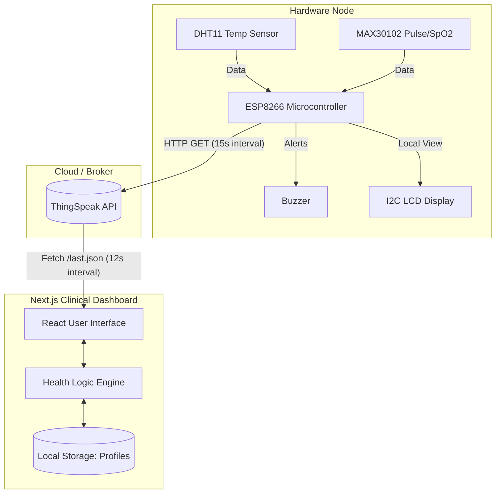

# 🩺 IoT Health Monitor & Clinical Dashboard


Welcome to the **IoT Health Monitor**, an end-to-end medical telemetry solution. This project seamlessly integrates a hardware sensor array (powered by an ESP8266) with a modern, responsive, and clinical-grade Next.js web dashboard to provide real-time patient vital sign monitoring. 

---

## ✨ Key Features

- **Real-Time Vitals Tracking**: Live monitoring of Temperature, Pulse Rate, and SpO2.
- **AI Clinical Chatbot**: Embedded assistant powered by Anthropic's Claude 3.5 Sonnet to provide instant triage advice based on live patient vitals.
- **NEWS2 Scoring System**: Automatic calculation of the National Early Warning Score (NEWS2) to assess illness severity and guide medical response.
- **Intelligent Frontend Health Engine**: Localized client-side evaluation of vitals with support for dynamic modifiers (Age and Pre-existing conditions).
- **Clinical-Grade UI**: A beautiful, glassmorphism-styled dashboard using React, Tailwind CSS, and Shadcn UI.
- **Hardware Agnostic**: Uses standard REST APIs (via ThingSpeak) to communicate between the hardware and the frontend.

---

## 🏗️ System Architecture

The system operates on a decoupled architecture, using **ThingSpeak** as a lightweight MQTT/REST broker to pass telemetry data from the ESP8266 sensors to the Next.js frontend.



---

## 🔌 Circuit Connections (ESP8266)

To build the hardware component of this project, wire the sensors to the ESP8266 as follows:

### 1. DHT11 (Temperature & Humidity)
| DHT11 Pin | ESP8266 NodeMCU Pin |
|-----------|---------------------|
| VCC       | 3V3                 |
| DATA      | D4 (GPIO2)          |
| GND       | GND                 |

### 2. MAX30102 (Pulse Oximeter & Heart Rate)
*Note: Uses I2C Communication*
| MAX30102 Pin | ESP8266 NodeMCU Pin |
|--------------|---------------------|
| VIN          | 3V3 / 5V (Check Mod)|
| SCL          | D1 (GPIO5)          |
| SDA          | D2 (GPIO4)          |
| GND          | GND                 |

### 3. LCD Display (16x2 with I2C Backpack)
| LCD I2C Pin | ESP8266 NodeMCU Pin |
|-------------|---------------------|
| VCC         | 5V (VIN)            |
| GND         | GND                 |
| SDA         | D2 (GPIO4)          |
| SCL         | D1 (GPIO5)          |

### 4. Alert Buzzer
| Buzzer Pin | ESP8266 NodeMCU Pin |
|------------|---------------------|
| Positive   | D7 (GPIO13)         |
| Negative   | GND                 |

---

## 🚀 Getting Started

### Phase 1: Hardware Setup
1. Assemble the circuit according to the tables above.
2. Open `firmware/HealthMonitor_ESP8266.ino` in the Arduino IDE.
3. Install required libraries: `ESP8266WiFi`, `DHT sensor library`, `LiquidCrystal I2C`, and `SparkFun MAX3010x`.
4. Update the WiFi credentials and ThingSpeak Write API Key in the code:
   ```cpp
   const char* SSID     = "YOUR_WIFI";
   const char* PASSWORD = "YOUR_PASS";
   const char* TS_API   = "YOUR_THINGSPEAK_WRITE_KEY";
   ```
5. Flash the code to your ESP8266.

### Phase 2: Frontend Setup
The frontend is built using Next.js and is located in the root of this repository.

1. Install dependencies:
   ```bash
   npm install
   # or
   pnpm install
   ```
2. Create a `.env.local` file in the root directory and add your Anthropic API key for the AI Chatbot:
   ```env
   ANTHROPIC_API_KEY=your_api_key_here
   ```
3. Start the development server:
   ```bash
   npm run dev
   ```
3. Open `http://localhost:3000` in your browser.
4. Click on **"⚙️ Profile & Settings"** in the top right header.
5. Enter your **ThingSpeak Channel ID** and **Read API Key**.

---

## 🌍 Deployment

Because the Next.js application is located in the root directory, it is **100% ready** for one-click deployment on platforms like Vercel or Render.

### Deploy to Vercel (Recommended)
1. Push this entire repository to your GitHub account.
2. Log in to [Vercel](https://vercel.com/) and click **"Add New Project"**.
3. Import your GitHub repository.
4. The build settings will automatically be detected as a Next.js framework.
5. Click **Deploy**. Within 2 minutes, your clinical dashboard will be live with a public URL!

---

## 🧠 Diagnostic Health Logic 

The frontend dashboard evaluates vitals using two parallel systems:

**1. NEWS2 Scoring (National Early Warning Score):**
- Calculates a clinical score (0-20) based on Temperature, Pulse, and SpO2.
- **Score 0-2**: Normal/Low Risk
- **Score 3-6**: Warning / Medium Risk
- **Score 7+**: High Risk / Emergency

**2. Direct Thresholds & Modifiers:**
- **Temperature**: Warning (37.5°C - 39.0°C) | Critical (< 36.0°C or > 39.0°C)
- **Pulse Rate**: Warning (100 - 120 bpm) | Critical (< 50 bpm or > 120 bpm)
- **SpO2**: Critical (< 90%)
- **Dynamic Modifiers**: 
  - If patient **Age > 50**, all warnings are elevated to critical alerts.
  - If patient has **Heart Disease** and Pulse > 100, the system immediately flags a Critical Alert, bypassing standard warning delays.

---
*Developed for IoT Healthcare Solutions*
"# HealthMon" 
